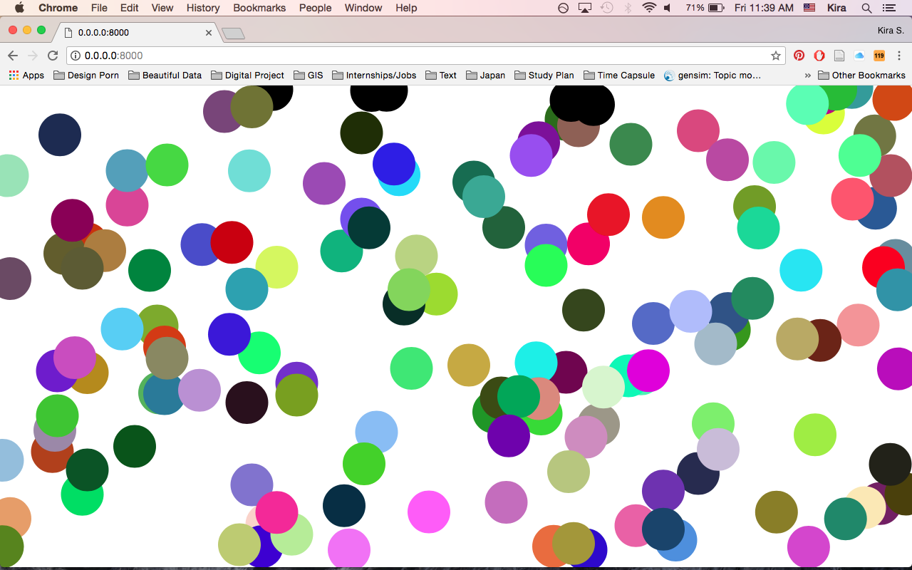

# project-proposal
# Final Project- Interactive Graphics and Critical Code

Name:  Kira Xie

Date: 04/19/2018

## Project: Who is controlling my script?

### Conceptual Description

My final project would draw on the concept on machine agency v.s. human agency. Inspired by how Artificial Intelligence (A.I.) has been seen as a threat to human world in popular culture. This project would try to elaborate on how much we can control the machine to achieve our ends. By collaborating with physical computing, this project would seek for understanding human intervation to machine codes and how chance operations cut off the human consciousness/superiority over machine.
### Interaction Description

My piece would be set up in a physical setting, assisted by Arduino Uno which connects the physical world witht the script with my piece. The users can potentially interact with my piece by simple phyisical gestures, such as clicking buttom. Instruction would be given to users on how to interact with the piece. Through doing simple physical gestures, the users would be given responses randomly by the script, which creates the illusion that we as the users are controlling the machine.  

### Extension 

This project would be an extension of the piece that i did with connecting things. In my previous piece, I have created clusters of dots which would change color when users intervene with the script. I am gonna add Arduino as an external tool for my piece. This extension would enhance user experience with the script.


### Drawing or Sketch of Extended Piece


### Technical Details
//   
Here you should give an overview of the technical aspects of your project:
* Libraries your using: p5.bots
* Hosting Platform (Heroku, Github Pages): Arduino
* Explanation of your codebase  
//

You can include code snippets here:

```js
functions setup(){
  createCanvas(windowWidth, windowHeight);
  arduino(connect to the script);
  for (i = 0;i<numellipes;i++){
		r = new EllipObj(random(width),random(height), 60);
		ellip.push(r);
	}
	buttom = new buttompress(buttom.x,buttom.y,60);
}

function draw(){
    background(255);
	for (i = 0; i<numellipes;i++){
		ellip[i].display();
		ellip[i].collide(buttom);	
        ellip[i].rollover(buttom);
        ellip[i].arduino(buttom)
	}
    buttom.disp(buttom.x,buttom.y);
    
	

}
class EllipObj{
	constructor(tempX, tempY, tempDia){
		this.x = tempX;
		this.y = tempY;
		this.diameter = tempDia;
		this.color = color(random(255),random(255),random(255));
		this.hit = false;
		this.over = false;

	}
	rollover(obj){
		var d = dist(obj.x,obj.y,this.x,this.y);
		if (d < this.diameter/2) {
			this.over = true;
		  } else {
			this.over = false;
		  }
	}
	display(){
		noStroke();
		fill(this.color);
		this.x += 3.5;
		if(this.x > windowWidth){
			this.x = 0;
		}
		ellipse(this.x,this.y,this.diameter,this.diameter);
		

	}
	collide(obj){
		this.hit = collideCircleCircle(this.x, this.y, this.diameter, obj.x, obj.y, obj.dia)
		
		if(this.hit){
			this.color = color(0)
			
		}
		if (this.over){
			
			noStroke();
			fill(random(255),random(255),random(255));
			ellipse(this.x,this.y,400,400);
		}

	}
}
```

Link to your project's full code in this repository:  [https://github.com/KiraXie17/connectingthings](https://github.com/KiraXie17/connectingthings)
